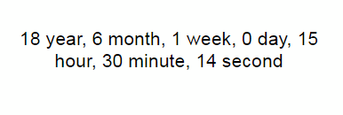
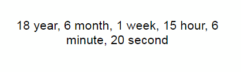
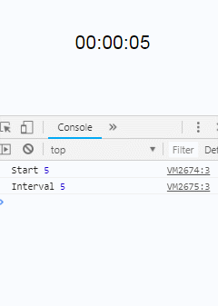
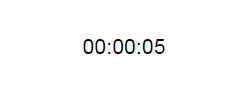

[](https://github.com/aykutkardas/mastertime/)

It allows you to create timers by writing very few JavaScript code.

## How to Use
----
#### Import Library
````js
<script src="your/path/to/mastertime-2.0.0.js"></script>
````
### start
````html
<div class="timer" mtStart="5"></div>
<script>
    var MT = new Mastertime;

    MT.build('.timer').run();
</script>
````


### end
````html
<div class="timer" mtStart="5" mtEnd="10"></div>
<script>
    var MT = new Mastertime;

    MT.build('.timer').run();
</script>
````

### way
way equal to "up"   end = Infinity

way equal to "down" end = 0

````html
<div class="timer" mtStart="5" mtWay="up"></div>
<script>
    var MT = new Mastertime;

    MT.build('.timer').run();
</script>
````


### date & template & config
````html
<div class="timer" mtDate="01.01.2000">
    {Y} year, 
    {M} month, 
    {W} week, 
    {D} day, 
    {h} hour, 
    {m} minute, 
    {s} second
</div>
<script>
    var MT = new Mastertime;

    MT.build('.timer', {
        timeFormat: 'Y:M:W:D:h:m:s',
        leftPad: false
    }).run();
</script>
````


Maybe this is problem. "0 day"! Edit html.
````html
<div class="timer" mtDate="01.01.2000">
    [{Y} year, ]
    [{M} month,  ] 
    [{W} week,  ] 
    [{D} day, ]
    [{h} hour, ]
    [{m} minute, ]
    [{s} second ]
</div>
````


### Events
#### onStart | onInterval | onEnd
````html
<div 
    class="timer" 
    mtStart="5" 
    mtEnd="0"
    mtOnStart="console.log('Start', event.start)"
    mtOnInterval="console.log('Interval', event.start)"
    mtOnEnd="console.log('End', event.start)">
</div>
<script>
    var MT = new Mastertime;

    MT.build('.timer').run();
</script>
````


#### Example
````html
<div 
    class="timer" 
    mtStart="5" 
    mtEnd="0"
    mtOnInterval="if(event.start <= 3) event.target.style.color = 'red'">
</div>
````
